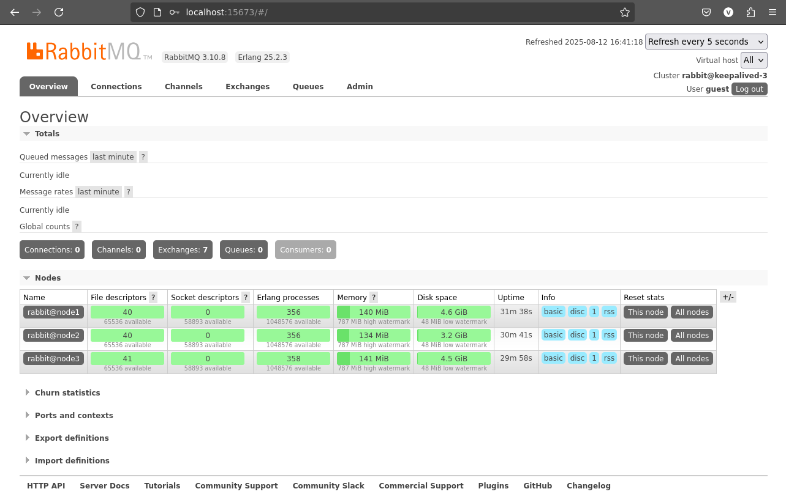
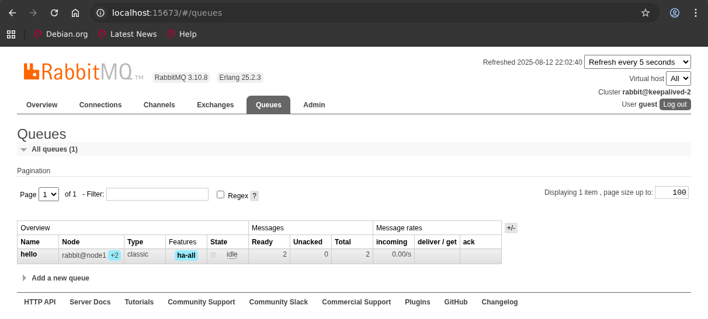

# Домашнее задание к занятию  «Очереди RabbitMQ». Потапчук Сергей.

### Инструкция по выполнению домашнего задания

1. Сделайте fork [репозитория c шаблоном решения](https://github.com/netology-code/sys-pattern-homework) к себе в Github и переименуйте его по названию или номеру занятия, например, https://github.com/имя-вашего-репозитория/gitlab-hw или https://github.com/имя-вашего-репозитория/8-03-hw).
2. Выполните клонирование этого репозитория к себе на ПК с помощью команды `git clone`.
3. Выполните домашнее задание и заполните у себя локально этот файл README.md:
   - впишите вверху название занятия и ваши фамилию и имя;
   - в каждом задании добавьте решение в требуемом виде: текст/код/скриншоты/ссылка;
   - для корректного добавления скриншотов воспользуйтесь инструкцией [«Как вставить скриншот в шаблон с решением»](https://github.com/netology-code/sys-pattern-homework/blob/main/screen-instruction.md);
   - при оформлении используйте возможности языка разметки md. Коротко об этом можно посмотреть в [инструкции по MarkDown](https://github.com/netology-code/sys-pattern-homework/blob/main/md-instruction.md).
4. После завершения работы над домашним заданием сделайте коммит (`git commit -m "comment"`) и отправьте его на Github (`git push origin`).
5. Для проверки домашнего задания преподавателем в личном кабинете прикрепите и отправьте ссылку на решение в виде md-файла в вашем Github.
6. Любые вопросы задавайте в чате учебной группы и/или в разделе «Вопросы по заданию» в личном кабинете.

Желаем успехов в выполнении домашнего задания.

---

### Задание 1. Установка RabbitMQ

Используя Vagrant или VirtualBox, создайте виртуальную машину и установите RabbitMQ.
Добавьте management plug-in и зайдите в веб-интерфейс.

*Итогом выполнения домашнего задания будет приложенный скриншот веб-интерфейса RabbitMQ.*

### Решение

Установил Docker, после установки
```Bash
docker run -d -h my-rabbit -p 15672:15672 rabbitmq:4-management
docker ps
```


---

### Задание 2. Отправка и получение сообщений

Используя приложенные скрипты, проведите тестовую отправку и получение сообщения.
Для отправки сообщений необходимо запустить скрипт producer.py.

Для работы скриптов вам необходимо установить Python версии 3 и библиотеку Pika.
Также в скриптах нужно указать IP-адрес машины, на которой запущен RabbitMQ, заменив localhost на нужный IP.

```shell script
$ pip install pika
```

Зайдите в веб-интерфейс, найдите очередь под названием hello и сделайте скриншот.
После чего запустите второй скрипт consumer.py и сделайте скриншот результата выполнения скрипта

*В качестве решения домашнего задания приложите оба скриншота, сделанных на этапе выполнения.*

Для закрепления материала можете попробовать модифицировать скрипты, чтобы поменять название очереди и отправляемое сообщение.

### Решение

1. [Producer](task-1/producer.py)

2. [Consumer](task-1/consumer.py)

```Bash
docker run -d -h my-rabbit -p 15672:15672 -p 5672:5672 rabbitmq:4-management
docker ps
```


---

### Задание 3. Подготовка HA кластера

Используя Vagrant или VirtualBox, создайте вторую виртуальную машину и установите RabbitMQ.
Добавьте в файл hosts название и IP-адрес каждой машины, чтобы машины могли видеть друг друга по имени.

Пример содержимого hosts файла:
```shell script
$ cat /etc/hosts
192.168.0.10 rmq01
192.168.0.11 rmq02
```
После этого ваши машины могут пинговаться по имени.

Затем объедините две машины в кластер и создайте политику ha-all на все очереди.

*В качестве решения домашнего задания приложите скриншоты из веб-интерфейса с информацией о доступных нодах в кластере и включённой политикой.*

Также приложите вывод команды с двух нод:

```shell script
$ rabbitmqctl cluster_status
```

Для закрепления материала снова запустите скрипт producer.py и приложите скриншот выполнения команды на каждой из нод:

```shell script
$ rabbitmqadmin get queue='hello'
```

После чего попробуйте отключить одну из нод, желательно ту, к которой подключались из скрипта, затем поправьте параметры подключения в скрипте consumer.py на вторую ноду и запустите его.

*Приложите скриншот результата работы второго скрипта.*

### Решение

Создал в докере новую сеть и запустил два контейнера RabbitMQ с одинаковым RABBITMQ_ERLANG_COOKIE, с разными именами хостов и порты нам понaдобятся только на одном, и собрал кластер.

```Bash
docker network create rabbitnet
docker run -d --name rabbit1 -h rabbit1 --network rabbitnet -e RABBITMQ_ERLANG_COOKIE='cookie' -p 15672:15672 -p 5672:5672 rabbitmq:4-management
docker run -d --name rabbit2 -h rabbit2 --network rabbitnet -e RABBITMQ_ERLANG_COOKIE='cookie' rabbitmq:4-management
docker exec rabbit2 rabbitmqctl stop_app
docker exec rabbit2 rabbitmqctl join_cluster rabbit@rabbit1
docker exec rabbit2 rabbitmqctl start_app
```


Важные изменения: в RabbitMQ 4.x полностью удалены классические mirrored queues А вместе с ними — и параметры: ha-mode и ha-sync-mode

Вместо них Нужно использовать Quorum Queues — это современная, отказоустойчивая замена для высокодоступных очередей.

Старый способ (RabbitMQ 3.x):
```Bash
rabbitmqctl set_policy ha-all "" '{"ha-mode":"all","ha-sync-mode":"automatic"}'
```

Новый способ (RabbitMQ 4.x):

Существует два типа очередей:

* **Quorum Queues** - современный тип очереди, который реализует устойчивую, реплицированную очередь на основе алгоритма консенсуса Raft и должен рассматриваться как выбор по умолчанию, когда требуется **реплицированная очередь с высокой доступностью**.

* **Classic Queues** - исходный тип очереди, подходящий для случаев, когда безопасность данных не является приоритетом, поскольку данные, хранящиеся в классических очередях, **не реплицируются**. Классические очереди используют **нереплицированную** реализацию очереди FIFO.

Классические очереди являются типом очереди по умолчанию, если тип очереди по умолчанию не переопределен для виртуального узла.

Можно установить для виртуального хоста другой тип очереди по умолчанию, например, "quorum", "stream" или "classic". Этот параметр называется default_queue_type и задаётся при создании или обновлении виртуального хоста.

Важные уточнения:

* Эта настройка влияет только на новые очереди, создаваемые без явного указания типа очереди.

* Тип очереди нельзя изменить для уже созданных очередей, так как тип очереди является неизменяемым параметром.

* Если клиент при объявлении очереди укажет x-queue-type, то этот тип будет использован в приоритете.

* В RabbitMQ версии 3.13.4 и выше (включая 4.x) появилась возможность задавать и node-wide default queue type в конфигурационном файле rabbitmq.conf (директива default_queue_type), но приоритет всегда имеет настройка виртуального хоста.

* В официальном RabbitMQ Docker образе нет переменной окружения, которая напрямую задаёт параметр default_queue_type, например "quorum", для виртуального хоста.     
Практическое исследование показало, что параметр deault_queue_type не сработал в моем случае (см. в конце задания).

Запустил [producer](task-3/producer.py) из прошлого задания и получил классическую очередь


Модифицировал (добавил параметры durable=True, arguments={'x-queue-type': 'quorum'}, без durable=True работать не будет, и изменил название очереди) и запустил [producer-tq](task-3/producer-tq.py) и получил quorum очередь.
```
channel.queue_declare(queue='hello', durable=True, arguments={'x-queue-type': 'quorum'})
```


Добавил виртуальный хост с параметром --default-queue-type quorum
```
docker exec rabbit1 rabbitmqctl add_vhost myvhost --default-queue-type quorum
```


Даже проверю установился ли параметр.
```
curl -u guest:guest http://localhost:15672/api/vhosts/myvhost
```


Снова модифицировал (добавил параметр virtual_host='myvhost'), и снова изменил название очереди) и запустил [producer-myvhost](task-3/producer-myvhost.py) и получил классическую очередь, хотя рассчитывал на quorum.


И, конечно, если указать quorum явно, то и результат будет соответствующий ([producer-myvhost-tq.py](task-3/producer-myvhost-tq.py)).


И попробую собрать кластер с помощью Docker-compose (как на лекции), RabbitMQ 3 и установить политику ha-all.

Конфигурация кластера:

* [./docker-compose.yml](task-3/docker-compose.yml)
* [./.env](task-3/.env)
* [./config/rabbitmq.conf](task-3/config/rabbitmq.conf)
* [./defs/def.json](task-3/defs/def.json)
* [./defs/enabled_plugins](task-3/defs/enabled_plugins)

```Bash
docker compose up -d
```


Для того, чтобы кластер был доступен при падении одной из нод можно пробросить разные ноды на разные порты.

[Все файлы третьего задания](task-3).

---

## Дополнительные задания (со звёздочкой*)
Эти задания дополнительные, то есть не обязательные к выполнению, и никак не повлияют на получение вами зачёта по этому домашнему заданию. Вы можете их выполнить, если хотите глубже шире разобраться в материале.

---

### * Задание 4. Ansible playbook

Напишите плейбук, который будет производить установку RabbitMQ на любое количество нод и объединять их в кластер.
При этом будет автоматически создавать политику ha-all.

*Готовый плейбук разместите в своём репозитории.*

### Решение

Создал playbook [./rabbitmq-cluster.yml](task-4/rabbitmq-cluster.yml). Ему понадобятся шаблоны формата jinja2: [./templates/rabbitmq-env.conf.j2](task-4/templates/rabbitmq-env.conf.j2) для файла переменных среды окружения и [./templates/rabbitmq.conf.j2](task-4/templates/rabbitmq.conf.j2) для конфигурационного файла. Конфигурационный файл Ansible [./ansible.cfg](task-4/ansible.cfg). И [./inventory.ini](task-4/inventory.ini). Переменная inventory_hostname будет использоваться в качестве имени хоста RabbitMQ.

Запускаем плейбук, проверяем успешность выполнения плейбука, поднятия кластера, и применения политик ha-all.





Чтобы не возиться с новыми пользователями и паролями пробросим SSH туннель к первой ноде (с пользователем и паролем guest можно работать только локально)


Отправим сообщение с помощью нашего [producer.py](task-4/producer.py) из первого задания (вполне подойдет)


Проверим, что получили в очереди.


Теперь перебросим туннель на вторую ноду и отправим сообщение так же.


Сообщение попало в очередь



Посмотрим состояние кластера


Уроним превую ноду командой
```Bash
sudo systemctl stop rabbitmq-server
```

проверим состояние кластера на второй ноде


и в web-интерфейсе RabbitMQ.


Мы убедились, что первая нода, на которой мы устанавливали политику ha-all не работает и попробуем отправить сообщение на третью ноду, для чего пробросим на нее туннель и отправим сообщение с помощью нашего producer.py.


Как видим сообщение попало в кластер.


Восстановим работоспособность первой ноды.


Кластер восстановился.


[Все файлы четвертого задания.](task-4)
